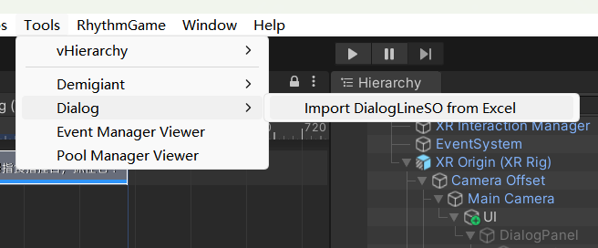
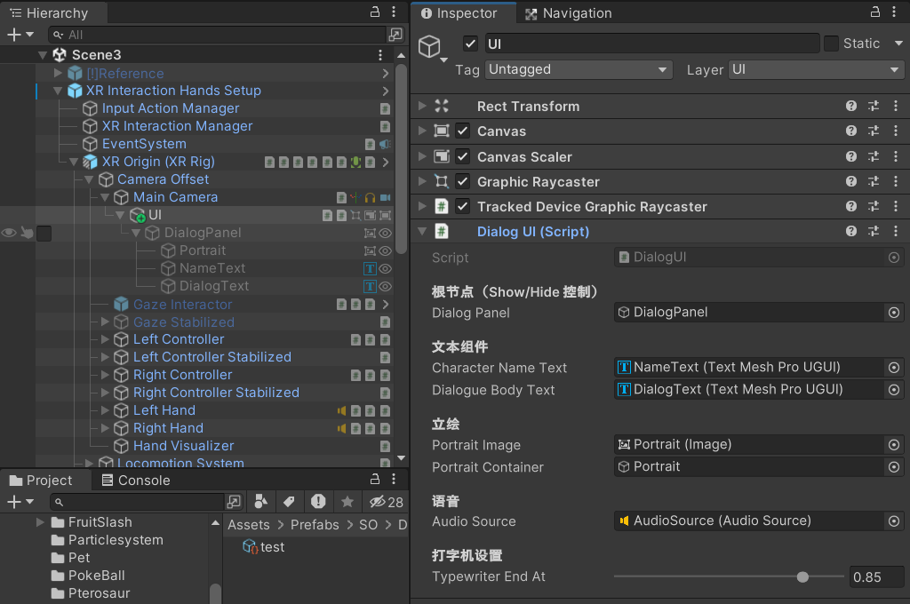
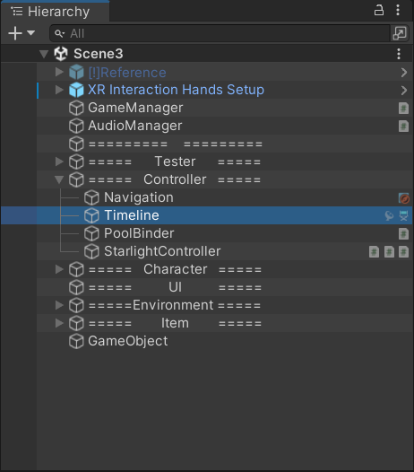
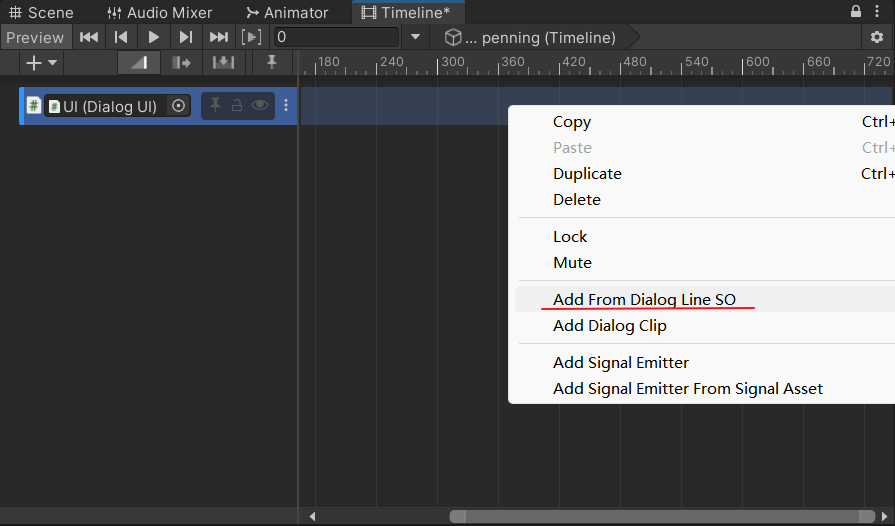
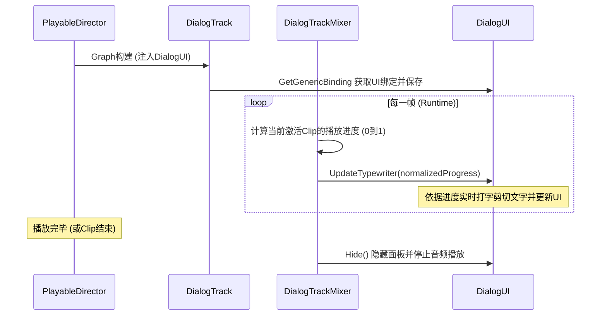

# Dialog Timeline 系统使用指南

Dialog Timeline 系统是一套用于在 Unity Timeline 中驱动游戏对话、角色立绘、打字机文字和语音播放的模块。本系统通过 Timeline 轨道与 Clip 进行帧级同步，支持语音长度自适应与大批量一键生成。

---

## 一、 核心组成

本系统采用“数据与表现分离”的设计理念，由以下核心部分组成：

1.  **[DialogLineSO](file:///e:/%E7%B3%BB%E7%BB%9F/%E6%96%87%E6%A1%A3/GitHub/VR_Zoo/Assets/Scripts/Core/Dialog/Timeline/DialogLineSO.cs) (数据源)**：
    *   继承自 `ScriptableObject`，单条对话的数据载体。
    *   包含角色名、角色表情/状态 (`characterState`)、立绘 Sprite、音频 Clip 以及时长配置。
2.  **[DialogUI](file:///e:/%E7%B3%BB%E7%BB%9F/%E6%96%87%E6%A1%A3/GitHub/VR_Zoo/Assets/Scripts/Core/Dialog/DialogUI.cs) (视图层)**：
    *   挂载在 UI 节点上的渲染脚本，提供立绘显示、打字机文字逐字渲染、语音 `AudioSource` 播放的接口。
3.  **[DialogTrack](file:///e:/%E7%B3%BB%E7%BB%9F/%E6%96%87%E6%A1%A3/GitHub/VR_Zoo/Assets/Scripts/Core/Dialog/Timeline/DialogTrack.cs) (轨道)**：
    *   Timeline 自定义对话轨道，绑定到 `DialogUI`。
4.  **[DialogClip](file:///e:/%E7%B3%BB%E7%BB%9F/%E6%96%87%E6%A1%A3/GitHub/VR_Zoo/Assets/Scripts/Core/Dialog/Timeline/DialogClip.cs) (片段)**：
    *   在 Timeline 时间轴上代表一段对话的 PlayableAsset。
5.  **[DialogTrackMixer](file:///e:/%E7%B3%BB%E7%BB%9F/%E6%96%87%E6%A1%A3/GitHub/VR_Zoo/Assets/Scripts/Core/Dialog/Timeline/DialogTrackMixer.cs) (混合器)**：
    *   计算当前播放 Clip 的归一化播放进度并实时通知 UI 播放。

---

## 二、 策划/美术使用步骤（Editor 配置流程）

### 1. 自动生成 DialogLineSO
1. 根据配表规范，在 Excel 中配置好 `Characters` 立绘表以及对话数据表。

   默认配置表位于`Assets\GameData\Dialogs.xlsx`

   配置表规范说明见`Assets\GameData\DialogsImport_Readme.md`

2. 点击 Unity 菜单栏：**`Tools > Dialog > Import DialogLineSO from Excel`**，导入生成对应的 `DialogLineSO` 资源。

   

### 2. 在 Timeline 中添加轨道并绑定
1. 在场景中，确保有一个挂载了 `DialogUI` 脚本的 UI 根节点。

   UI路径说明：

   

   Timeline路径说明：

   

2. 选中带有 `PlayableDirector` 的物体（如 Timeline 引导物体），打开 **Timeline 窗口**。

3. 在 Timeline 轨道的空白处**右键**，在弹出菜单中选择 **`Dialog Track`**（蓝色标识）。

4. 将场景中挂载了 `DialogUI` 的 GameObject 拖拽入该 `Dialog Track` 左侧的 **Track Binding** 槽中。

### 3. 添加对话 Clip
有以下两种方式向轨道添加对话：
* **拖拽导入（推荐）**：直接从 Project 视图中，将生成好的 `DialogLineSO` 文件拖入 `Dialog Track` 轨道的时间轴上。
* **右键创建**：在 `Dialog Track` 的时间轴空白处右键选择 **`Add Dialog Clip`**。选中生成的 Clip，在 Inspector 的 `Dialog Line` 槽中，拖入对应的 `DialogLineSO` 资源。
* **绑定语音源（必须）**：选中轨道上的任一 Dialog Clip，在 Inspector 面板中的 **`Audio Source`** 引用槽中，**必须将场景中播放该台词的 AudioSource 组件（如挂在相应 3D 角色头部的 AudioSource）拖入绑定**。
  *   *注*：系统对该字段不进行空值保护，如果漏配，在运行时播放该句台词时会**直接报错抛出空引用异常（NullReferenceException）**，以确保在测试阶段能第一时间发现和修复配置遗漏。

  

### 4. 自动长度同步与台词预览
*   系统集成了编辑器工具 [DialogClipEditor](file:///e:/%E7%B3%BB%E7%BB%9F/%E6%96%87%E6%A1%A3/GitHub/VR_Zoo/Assets/Editor/Dialog/DialogClipEditor.cs)。当您将 `DialogLineSO` 赋给 Clip，或修改了 SO 数据时，**Clip 的长度会自动缩放到合适的时长**（如果开启了 `useAudioDuration`，则自动设为音频文件的物理长度 + 末尾缓冲时间）。
*   同时，Timeline 上的 Clip 名称会自动更新为 **`角色名：台词前20个字...`**，免去了手动命名的麻烦。

---

## 三、 运行时工作原理（程序参考）

### 1. 打字机进度控制
为了保证在任何帧率下打字机进度均与 Timeline 时间线绝对一致，系统不使用传统的协程（Coroutine）驱动打字机，而是通过 `DialogTrackMixer` 在 `ProcessFrame` 中计算当前播放时刻：
$$\text{normalized} = \text{clipTime} / \text{clipDuration}$$
这个 $0 \sim 1$ 的数值被传递给 `DialogUI.UpdateTypewriter()` 方法。该方法内部将这一进度进行重映射，确保在 Clip 时长的 $85\%$（可调）时间内打完全部文字，剩下的 $15\%$ 时长用于供玩家阅读，确保了良好的视觉体验和精确的视听对齐。
